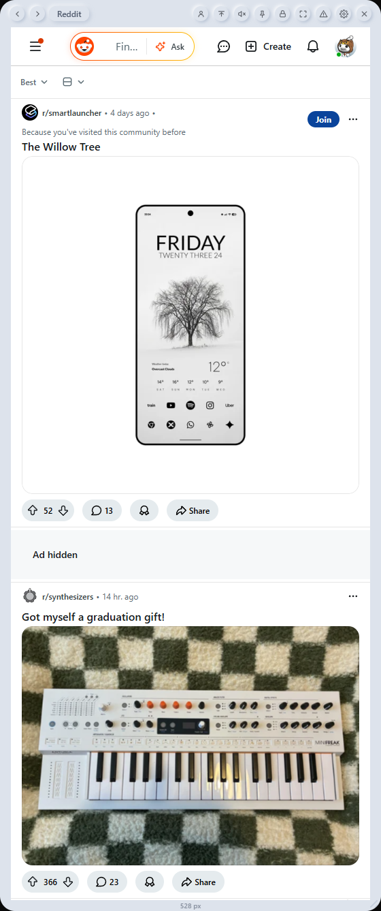
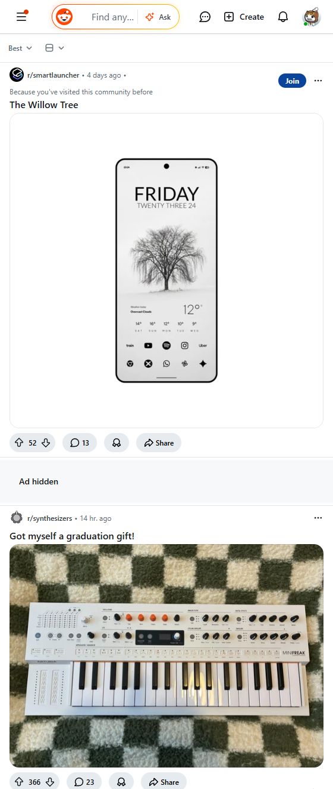
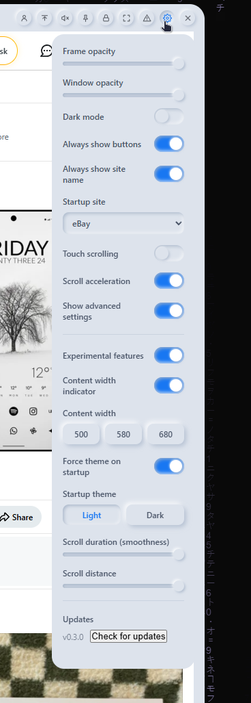
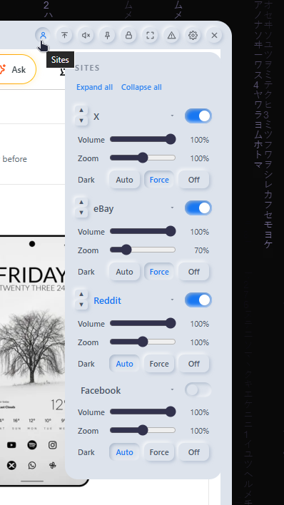
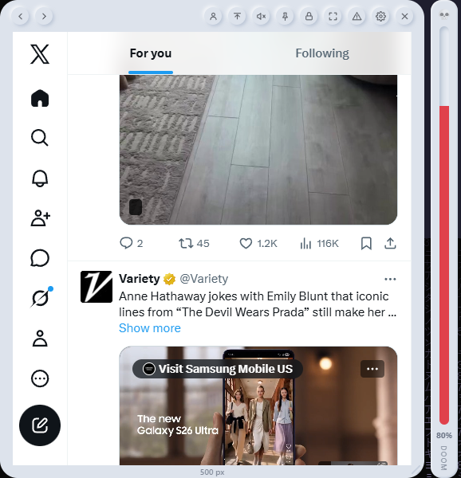

# Doom Scroll

### Every feed you love, in one tiny window — *doomscroll* in style. 🌀

A borderless, chromeless desktop widget that nests web feeds — Facebook, X, Reddit, eBay — inside a soft neumorphic frame, so they read as **part of your desktop** rather than yet another window on top of it.

 

**[⬇️ Download the latest Beta](../../releases)**

---

> [!NOTE]
> **Doom Scroll is in Beta.** It updates itself — install once and new versions arrive automatically (with your OK). 🎉

Doom Scroll sits quietly on your desktop: a transparent, rounded, neumorphic panel holding a live web feed. Move it, resize it, dim it, pin it on top, flip it to dark mode, run several feeds side-by-side, or melt the frame away entirely for an edge-to-edge view. It feels less like an app window and more like a little window *into* the desktop itself.

  

---

## ✨ Features

### 🌀 Doom Meter *(new)*
- A floating meter beside the window that **fills the more you scroll** — your own doomscroll gauge.
- **Per-site**: each feed tracks its own doom; the meter shows whichever you're viewing.
- **Persists** across restarts and **resets each day**. Fill ramps green → amber → red, and the 💀 ignites at 100%.
- Follows the window as you move it; toggle it off anytime in Settings.

### 🌐 Many feeds, one tiny frame
- Curated sites built in: **Facebook**, **X**, **Reddit**, and **eBay**.
- Flip between them with the **carousel arrows** — a soft site-name pill flashes as you switch (or pin it on permanently).
- **Enable, disable, and reorder** sites in the Sites panel.
- Pick which site **opens on startup** — or just resume your last.

### 🔲 Multi-site display *(experimental)*
- Show **2, 3, or 4 feeds side-by-side** in one panel.
- The window grows to fit and scales each column down gracefully (capped so it never sprawls past your screen).

### 🌑 Dark mode done *right*
- One toggle theme for the whole app — chrome and feeds.
- **Per-site dark control**: `Auto` (follow the site's native theme), `Force` (clean Chromium force-dark — proper dark backgrounds while photos keep their real colors, à la Opera GX), or `Off`.

### 🔍 Per-site zoom
- A zoom slider for **each** site (0.5×–1.5×) — shrink a busy feed, enlarge a cramped one. Remembered per site.

### 🔊 Sound, your way
- A **volume slider per site**, plus a one-click **global mute** in the title strip. Silence autoplay without muting your whole system.

### 🖱️ Scrolling that feels native
- **Touch / drag scrolling** for trackpads and touchscreens.
- Optional **scroll acceleration** with smooth easing — and it's smart enough to *not* hijack nested scroll areas (like Facebook's comment pop-ups).
- Fine-tune **smoothness** and **distance** in advanced settings.

### 👻 Borderless & immersive
- **Immersive mode** melts the frame for a true edge-to-edge feed — a faint pill is the only handle to drag or exit.
- **Hover-reveal controls** keep the panel clean until you need it (or pin the buttons on).

### 🎚️ Blend it into your desktop
- **Frame opacity** and **whole-window opacity** sliders to make Doom Scroll as present — or as ghostly — as you like.
- **Pin on top** 📌, **lock position & size** 🔒, and neumorphic soft-shadow styling throughout.

### 🔄 Automatic updates *(new in Beta)*
- Doom Scroll checks for new versions on launch and offers a tidy **Install / Later** prompt — or check anytime from **Settings → Updates**.
- Updates are **cryptographically signed** and verified before they're applied; the app downloads, installs, and relaunches itself.

### 🔒 Private by design
- Doom Scroll is a thin frame around the **real** sites running in a local WebView — no middleman, no proxy, no account.
- Your logins live in Doom Scroll's own local browser profile and simply persist between launches.

---

## ⬇️ Download & Install

Grab the newest build from the **[Releases page](../../releases)**:

| 🖥️ OS | 📦 Files |
|---|---|
| **Windows** | `Doom Scroll_x.y.z_x64-setup.exe` (installer) · `Doom Scroll_x.y.z_x64_en-US.msi` |
| **macOS** | `Doom Scroll_x.y.z_aarch64.dmg` (Apple Silicon) |
| **Linux** | `.AppImage` · `.deb` · `.rpm` |

> [!IMPORTANT]
> Installers aren't code-signed for the OS yet, so **Windows SmartScreen** or **macOS Gatekeeper** may warn on first launch.
> Windows: **More info → Run anyway**. macOS: **right-click → Open**.
> *(Update packages **are** signed with Doom Scroll's own key and verified by the app — this notice is only about the OS-level installer signature.)*

After your first install, you won't need this page again — Doom Scroll keeps itself up to date. ✅

---

## 📸 Screenshots

<table>
  <tr>
    <td width="50%" align="center">
       
      <b>The neumorphic frame</b> — a feed nested into the desktop
    </td>
    <td width="50%" align="center">
       
      <b>Live feeds</b> — the real site, running right in the panel
    </td>
  </tr>
  <tr>
    <td width="50%" align="center">
       
      <b>Settings</b> — opacity, theme, scrolling, startup &amp; updates
    </td>
    <td width="50%" align="center">
       
      <b>Per-site controls</b> — volume, zoom &amp; dark mode for each feed
    </td>
  </tr>
  <tr>
    <td width="50%" align="center">
       
      <b>Doom Meter</b> — fills as you doomscroll (per-site, resets daily)
    </td>
    <td width="50%" align="center"></td>
  </tr>
</table>

---

## 🚀 Quick start

1. **Launch Doom Scroll** — a neumorphic panel appears with your starting feed.
2. **Log in** to a site once; the session persists.
3. **Hover** the panel to reveal the control strip:

| Control | What it does |
|---|---|
| ◀ ▶ | Switch between feeds |
| 👤 *(Sites)* | Enable/reorder sites, per-site zoom · dark · volume |
| 🔼 | Scroll to top (click again to return) |
| 🔇 | Mute all audio |
| 📌 | Always on top |
| 🔒 | Lock position & size |
| ⛶ | Immersive (borderless) mode |
| ⚠️ | Experimental features (multi-site) |
| ⚙️ | Settings |

4. **Drag** the top strip to move it, grab an edge/corner to resize, and tweak the rest in **Settings**.

---

## ⚙️ Settings at a glance

<b>Everything you can tune</b> (click to expand)

 

- **Appearance** — frame opacity, window opacity, dark mode, always-show-buttons, always-show site name.
- **Startup** — choose the startup site; optionally force a light/dark theme on launch.
- **Scrolling** — touch scrolling, scroll acceleration, plus advanced smoothness & distance.
- **Per-site** (Sites panel) — zoom, dark handling (Auto/Force/Off), and volume for each feed; expand/collapse all.
- **Experimental** — multi-site display (2–4 feeds at once).
- **Advanced** — content-width presets, width indicator, startup-theme override.
- **Updates** — see your version and check for updates on demand.

---

## 💬 Beta & feedback

This is an early Beta — expect rough edges, and please share what you find. Bug reports, feature ideas, and screenshots are all welcome on the **[Issues](../../issues)** page. 🙏

See the **[Changelog](CHANGELOG.md)** for what's new in each release.

---

The source code is maintained in a private repository. Releases here are built, signed, and published automatically from that source.

Made with 🪟 + ☕

